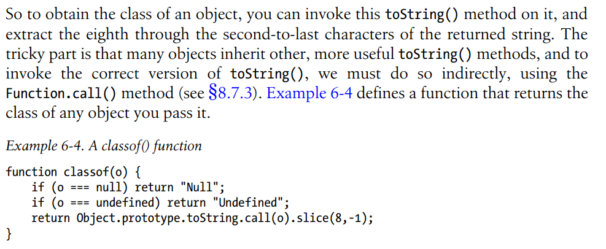

## 6.8 Object Attributes
### 6.8.1 The prototype attribute

What does the last sentence mean?
```javascript
var p = {}; //an object literal
p.constructor.prototype === Object.prototype; //true
//refers to the correct prototype of p
o = Object.create(p);
o.constructor.prototype === p.constructor.prototype;//true
//not the correct prototype of o
o.__proto__ === p;//true
Object.getPrototypeOf(o) === p; //true
```

### 6.8.2 The class attribute

Here a universal method to obtain the class of an object is introduced. It is also a frequently asked question in the interview.
But the author pointed out that "there is no way to specify the class attribute for your own classes of objects", which requires us to extend the ``classof`` function.
```javascript
function classof(o) {
    var klass = Object.prototype.toString.call(o).slice(8,-1); //equivalent to substring
    return klass !== "Object" ? klass :  Object.getPrototypeOf(o).constructor.name;
}
```
Actually, for array, there is now no need to write long codes to test. Just use ``Array.isArray()``(see [§7.10](../Chapter7/7.10.md)).