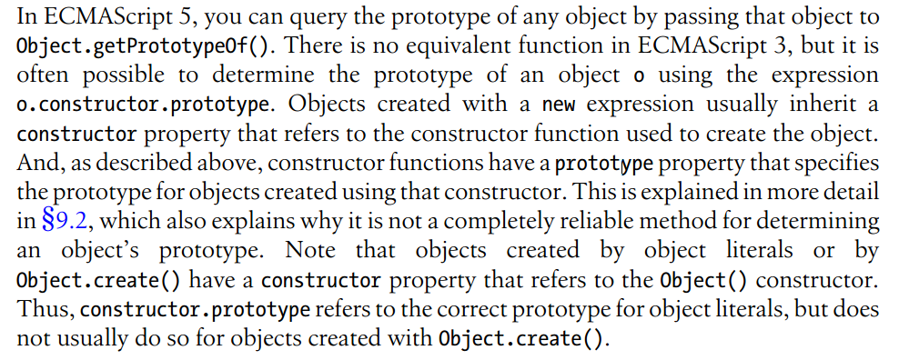

What does the last sentence mean?
```javascript
var p = {}; //an object literal
p.constructor.prototype === Object.prototype; //true
//refers to the correct prototype of p
o = Object.create(p);
o.constructor.prototype === p.constructor.prototype;//true
//not the correct prototype of o
o.__proto__ === p;//true
Object.getPrototypeOf(o) === p; //true
```