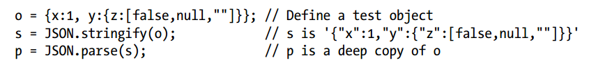

## 6.9 Serializing Objects


Note that this code presents a simple way of deep copying an object, using which, however, may cause some underlying mistakes.
```javascript
var obj = {a: NaN, b: false, c: undefined, d: null, e: ''};
var copy = JSON.parse(JSON.stringify(obj)); //{a: null, b: false, d: null, e: ''}
```

> The Object.assign() method is used to copy the values of all **enumerable own properties** from one or more source objects to a target object. It will return the target object.
> For deep cloning, we need to use other alternatives. This is because Object.assign() copies the property reference when the property being assigned is an object.

To find out more, see documentation [Object.assign()](https://developer.mozilla.org/zh-CN/docs/Web/JavaScript/Reference/Global_Objects/Object/assign) and an article [深入剖析 JavaScript 的深复制](http://jerryzou.com/posts/dive-into-deep-clone-in-javascript/).