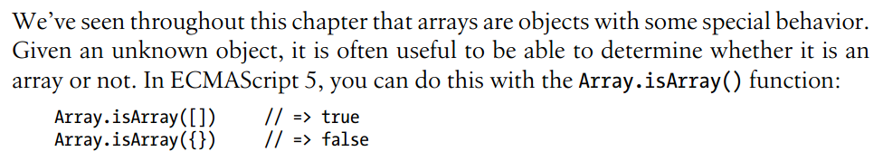
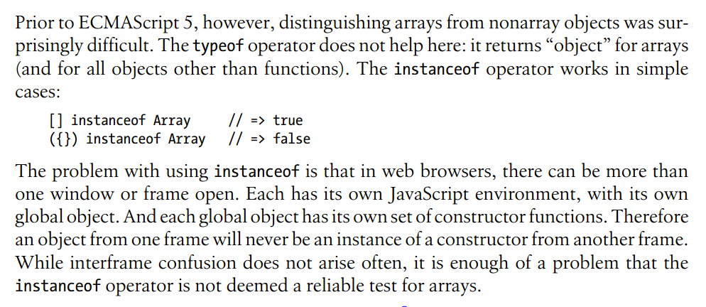
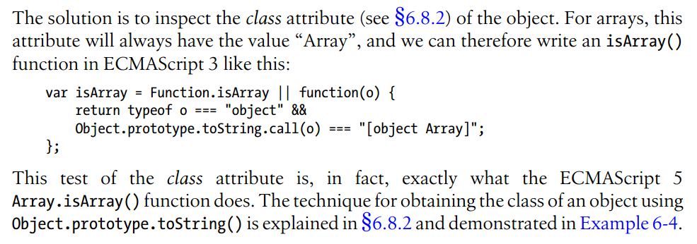

That's why we are often asked "how to test whether an object is an array" in interviews. Note that there is a pair of parentheses in ``({}) instanceof Array``.
I cannot imagine an occasion where "an object from one frame will never be an instance of a constructor from another frame" for my lack of project experience.
