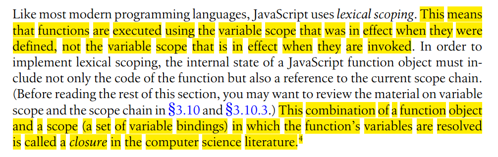

[I gradually realize that perhaps it is the bad translation rather than my poor perception that makes it difficult for me to understand the content of the book. I have to read the Chinese version of this book and the original text later on.]
```javascript
function addPrivateProperty(o, name, predicate) {
    var value;
    o['get' + name] = function(v) {
        return value;
    }
    o['set' + name] = function(v) {
        if (predicate && !predicate(v))
            throw Error("set" + name + ":invalid value " + v);
        else
            value = v;
    }
}
var o = {};
addPrivateProperty(o, "Name", function(x) {
    return typeof x == "string";
});
o.setName("Frank");
console.log(o.getName());
addPrivateProperty(o, "Age", function(x) {
    return typeof x == "number";
});
o.setAge(28);
console.log(o.getAge());
```

```javascript
function counter(n){
    return {
        get count() { return n++;},  //Oh don't forget this comma
        set count(m) {
            if(m >= n) n = m;
            else throw Error("count can only be set to a larger value");
        }
    };
}
var c = counter(1000);
c.count;
c.count = 2000;
c.count;
```
See [图解Javascript上下文与作用域](http://blog.rainy.im/2015/07/04/scope-chain-and-prototype-chain-in-js/)